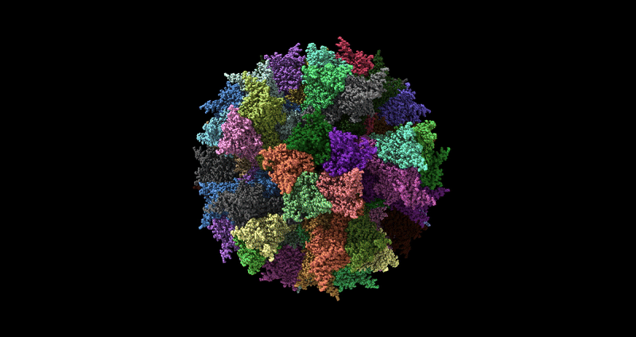

# Poiesis

  

_A modular framework for reproducible generative protein design._

Poiesis aims to unify modern open-source protein design and structure prediction tools into reproducible, scalable workflows for computational protein engineering.

The framework focuses on:
- reproducible workflow orchestration
- containerised deployment
- HPC compatibility
- modular integration of generative design models
- downstream structural analysis and visualisation

Designed for both exploratory research and scalable computational pipelines, Poiesis aims to simplify iterative protein engineering workflows across modern AI-driven design platforms.

## Planned capabilities

- _De novo_ peptide and protein generation
- Context-aware binder/interface design
- Multi-model structure prediction and consensus scoring
- Complex-aware design workflows
- Experimental candidate ranking
- Structural visualisation and analysis
- HPC-ready scalable execution
- Reproducible containerised deployment

## Example workflow
Input sequence / target
        ↓
RFdiffusion
        ↓
ProteinMPNN
        ↓
AlphaFold2 / Protenix
        ↓
Scoring + ranking
        ↓
Visualisation + reports
